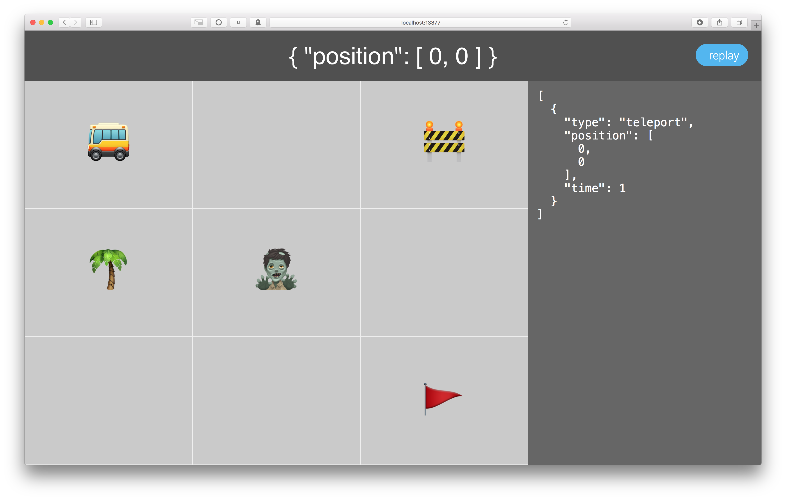

# event-sourcing-sample

A little game to show how event sourcing works. 

It shows the current application state and the event log which can be replayed.

## Install

```
$ npm install
```


## Usage

```
$ cd event-sourcing-sample/src
$ node server.js
```
server running on http://localhost:5000
